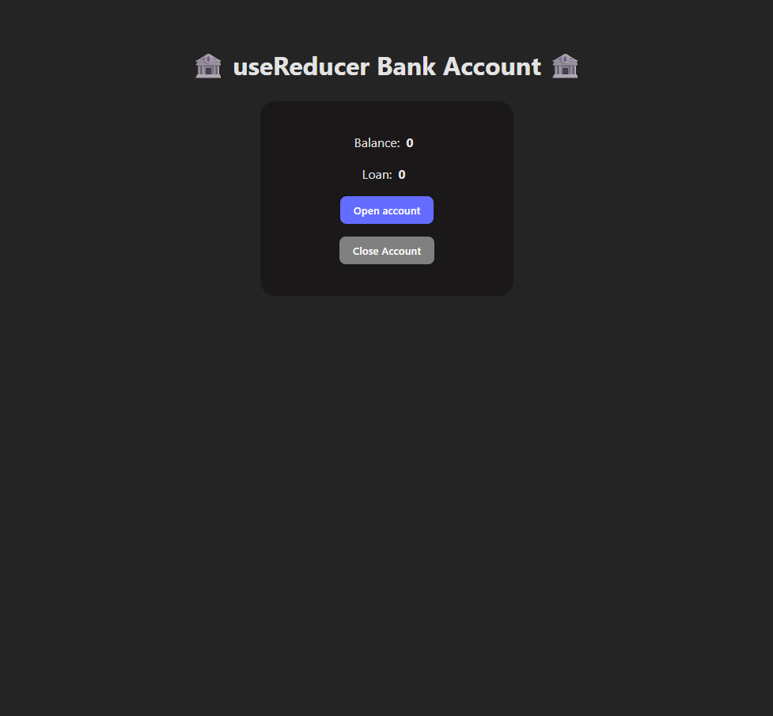
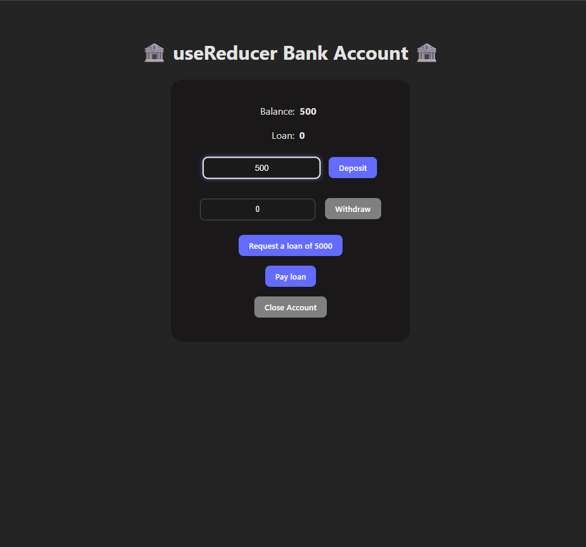

# useReducer Bank Account

A simple project created to practice managing state with `useReducer`.

# 🧩 Features

- Open an account (starts with a balance of 500)
- Deposit chosen amount of money
- Withdraw chosen amount of money
- Take a single loan (5000)(you can only take 1 loan at a time)
- Repay the loan
- Close the account (only if balance is empty and there is no loan taken )

# 🛠 Technologies

- React
- Vite

# Screenshots




# To run:

```bash
git clone https://github.com/KucielKrzysztof/useReducer-Bank-Account.git
 cd useReducer-Bank-Account

npm i
npm run dev

  ➜  Local:   http://localhost:5173/
```
